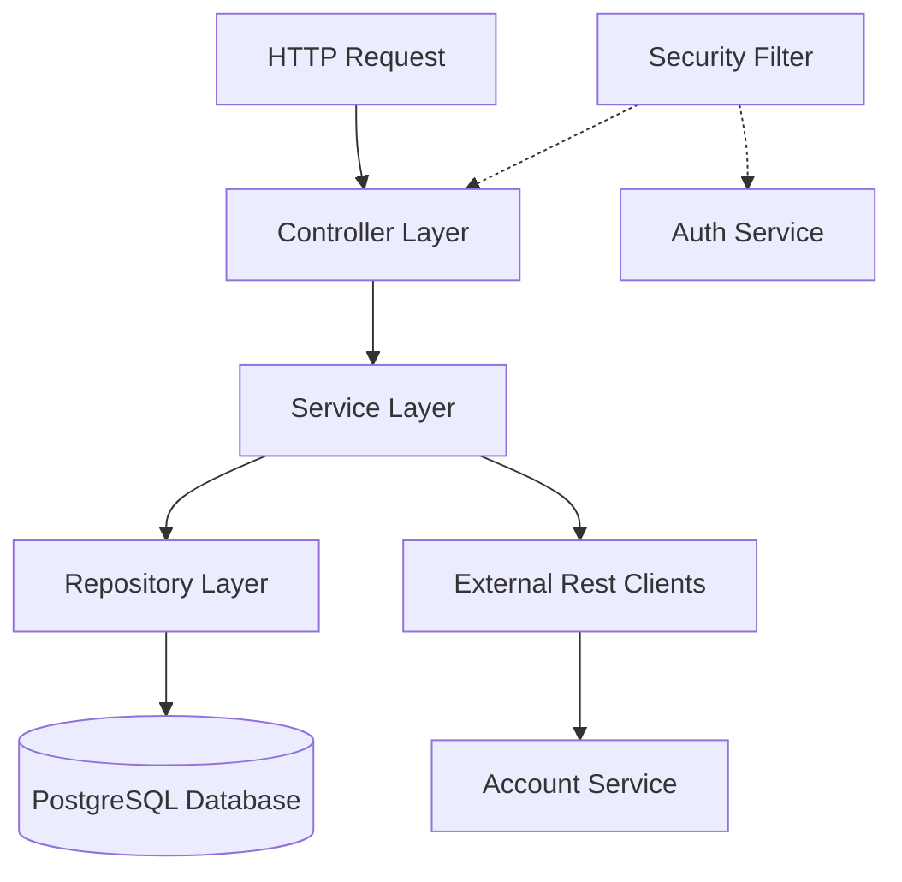

# Credit Card Service - Architecture & Structure Documentation

This document explains the design, directory structure, schema, API endpoints, security mechanisms, and integration details of the **Credit Card Service** (`credit-cards-service`).

---

## 1. Overview & Architecture

The Credit Card Service is a Spring Boot application designed to manage credit cards and transactions. It follows a clean, layered architecture consisting of the following layers:

1. **Presentation / Web Layer**: Exposes REST API endpoints via Spring Controllers and handles HTTP request/response mappings.
2. **Business Logic Layer**: Implements business rules (e.g. card approval limits, bill payment logic).
3. **Data Access / Repository Layer**: Interfaces with PostgreSQL using Spring Data JPA.
4. **Integration Client Layer**: Communicates with downstream microservices (`auth-service` and `account-service`) via `RestTemplate`.
5. **Security Layer**: Intercepts requests, validates authorization headers, and builds a ThreadLocal security context.

---

## 2. Directory Structure

The files of this microservice are structured as follows:

- [pom.xml](file:///Users/sagarsewak/Documents/Personal/College/STEP/OFFLINE/gdb-service-feature-java-additional-services/credit-cards-service/pom.xml): Dependency management (Spring Boot 3.4.2, Java 17)
- [schema.sql](file:///Users/sagarsewak/Documents/Personal/College/STEP/OFFLINE/gdb-service-feature-java-additional-services/credit-cards-service/schema.sql): Complete PostgreSQL Schema DDL (local & seeding reference)
- [CreditCardsServiceApplication.java](file:///Users/sagarsewak/Documents/Personal/College/STEP/OFFLINE/gdb-service-feature-java-additional-services/credit-cards-service/src/main/java/com/gdb/creditcards/CreditCardsServiceApplication.java): Service Bootstrapper
- [AccountServiceClient.java](file:///Users/sagarsewak/Documents/Personal/College/STEP/OFFLINE/gdb-service-feature-java-additional-services/credit-cards-service/src/main/java/com/gdb/creditcards/client/AccountServiceClient.java): Downstream HTTP client for account-service (debits)
- [AuthClient.java](file:///Users/sagarsewak/Documents/Personal/College/STEP/OFFLINE/gdb-service-feature-java-additional-services/credit-cards-service/src/main/java/com/gdb/creditcards/client/AuthClient.java): Downstream HTTP client for auth-service (JWT verification)
- [CorsConfig.java](file:///Users/sagarsewak/Documents/Personal/College/STEP/OFFLINE/gdb-service-feature-java-additional-services/credit-cards-service/src/main/java/com/gdb/creditcards/config/CorsConfig.java): Cross-Origin Resource Sharing settings
- [CreditCardController.java](file:///Users/sagarsewak/Documents/Personal/College/STEP/OFFLINE/gdb-service-feature-java-additional-services/credit-cards-service/src/main/java/com/gdb/creditcards/controller/CreditCardController.java): REST Endpoint handler
- [CreditCard.java](file:///Users/sagarsewak/Documents/Personal/College/STEP/OFFLINE/gdb-service-feature-java-additional-services/credit-cards-service/src/main/java/com/gdb/creditcards/domain/CreditCard.java): JPA Entity mapping to `credit_cards`
- [CreditCardTransaction.java](file:///Users/sagarsewak/Documents/Personal/College/STEP/OFFLINE/gdb-service-feature-java-additional-services/credit-cards-service/src/main/java/com/gdb/creditcards/domain/CreditCardTransaction.java): JPA Entity mapping to `credit_card_transactions`
- [CreditCardDto.java](file:///Users/sagarsewak/Documents/Personal/College/STEP/OFFLINE/gdb-service-feature-java-additional-services/credit-cards-service/src/main/java/com/gdb/creditcards/dto/CreditCardDto.java): Card Transfer Object
- [CreditCardTransactionDto.java](file:///Users/sagarsewak/Documents/Personal/College/STEP/OFFLINE/gdb-service-feature-java-additional-services/credit-cards-service/src/main/java/com/gdb/creditcards/dto/CreditCardTransactionDto.java): Transaction Transfer Object
- [CreditCardRepository.java](file:///Users/sagarsewak/Documents/Personal/College/STEP/OFFLINE/gdb-service-feature-java-additional-services/credit-cards-service/src/main/java/com/gdb/creditcards/repository/CreditCardRepository.java): JPA Repository for CreditCard
- [CreditCardTransactionRepository.java](file:///Users/sagarsewak/Documents/Personal/College/STEP/OFFLINE/gdb-service-feature-java-additional-services/credit-cards-service/src/main/java/com/gdb/creditcards/repository/CreditCardTransactionRepository.java): JPA Repository for CreditCardTransaction
- [SecurityFilter.java](file:///Users/sagarsewak/Documents/Personal/College/STEP/OFFLINE/gdb-service-feature-java-additional-services/credit-cards-service/src/main/java/com/gdb/creditcards/security/SecurityFilter.java): Custom JWT interceptor filter
- [UserContext.java](file:///Users/sagarsewak/Documents/Personal/College/STEP/OFFLINE/gdb-service-feature-java-additional-services/credit-cards-service/src/main/java/com/gdb/creditcards/security/UserContext.java): Context holder entity for current user details
- [UserContextHolder.java](file:///Users/sagarsewak/Documents/Personal/College/STEP/OFFLINE/gdb-service-feature-java-additional-services/credit-cards-service/src/main/java/com/gdb/creditcards/security/UserContextHolder.java): ThreadLocal wrapper context
- [CreditCardService.java](file:///Users/sagarsewak/Documents/Personal/College/STEP/OFFLINE/gdb-service-feature-java-additional-services/credit-cards-service/src/main/java/com/gdb/creditcards/service/CreditCardService.java): Service Interface
- [CreditCardServiceImpl.java](file:///Users/sagarsewak/Documents/Personal/College/STEP/OFFLINE/gdb-service-feature-java-additional-services/credit-cards-service/src/main/java/com/gdb/creditcards/service/impl/CreditCardServiceImpl.java): Business Logic Implementation
- [application.yml](file:///Users/sagarsewak/Documents/Personal/College/STEP/OFFLINE/gdb-service-feature-java-additional-services/credit-cards-service/src/main/resources/application.yml): Service & database configuration profiles
- [V1__Initial_Schema.sql](file:///Users/sagarsewak/Documents/Personal/College/STEP/OFFLINE/gdb-service-feature-java-additional-services/credit-cards-service/src/main/resources/db/migration/V1__Initial_Schema.sql): Flyway schema migration script

---

## 3. Database Schema

The service uses PostgreSQL for persistence. Schema migrations are managed automatically at startup by Flyway via [V1__Initial_Schema.sql](file:///Users/sagarsewak/Documents/Personal/College/STEP/OFFLINE/gdb-service-feature-java-additional-services/credit-cards-service/src/main/resources/db/migration/V1__Initial_Schema.sql).

### Tables

1. **`credit_cards`**:
   - `id` (VARCHAR(36), PK): UUID of the card.
   - `user_id` (BIGINT, Not Null): ID of the owner user.
   - `card_number` (VARCHAR(30), Unique, Not Null): Masked card number (e.g. `**** **** **** 4589`).
   - `card_type` (VARCHAR(20), Not Null): Type of credit card (`Silver`, `Gold`, `Platinum`).
   - `credit_limit` (NUMERIC(15, 2), Not Null): The max credit allowed.
   - `available_credit` (NUMERIC(15, 2), Not Null): Remaining spend capacity.
   - `outstanding_amount` (NUMERIC(15, 2), Not Null): Current unpaid bill.
   - `minimum_due` (NUMERIC(15, 2), Not Null): Minimum amount to pay to avoid late fees.
   - `next_due_date` (DATE): Payment deadline date.
   - `status` (VARCHAR(20), Default 'Active'): Card state (e.g. `Active`, `Blocked`).

2. **`credit_card_transactions`**:
   - `id` (VARCHAR(36), PK): UUID of the transaction.
   - `card_id` (VARCHAR(36), FK references `credit_cards`): Associated card.
   - `date` (TIMESTAMP): Date and time of the event.
   - `merchant` (VARCHAR(255)): Payee name.
   - `amount` (NUMERIC(15, 2)): Transaction amount.
   - `type` (VARCHAR(20)): Type of action (`Purchase`, `Payment`, `Refund`).
   - `status` (VARCHAR(20), Default 'Completed'): Status state.

### Performance Indexes
- `idx_credit_cards_user_id` on `credit_cards(user_id)`
- `idx_credit_card_transactions_card_id` on `credit_card_transactions(card_id)`
- `idx_credit_card_transactions_date` on `credit_card_transactions(date)`

---

## 4. API Specification

All HTTP endpoints are prefixed with `/api/v1/credit-cards` and require a valid Bearer JWT.

| Method | Endpoint | Description | Request Body |
| :--- | :--- | :--- | :--- |
| **GET** | `/user/{userId}` | Fetch all credit cards for the given user ID. | None |
| **POST** | `/apply` | Apply for a new card. Owner user ID is resolved from token. | `CreditCardDto` (Requires `cardType`) |
| **GET** | `/{id}` | Get detailed card details by Card UUID. | None |
| **GET** | `/{id}/transactions` | Fetch card transactions with optional filtering. Query params: `type`, `fromDate`, `toDate`. | None |
| **POST** | `/{id}/pay` | Pay outstanding balance using a specific bank account. | `{ "amount": 100.0, "debitAccount": 1234567890 }` |

---

## 5. Security & Context Resolution

The security layer intercepts all requests to validate permissions:

1. **`SecurityFilter`**: A standard Spring `OncePerRequestFilter`. It skips validation for OPTIONS requests, Swagger UI routes, health checks, and `/internal/` endpoints. For all other routes:
   - Extracts the `Bearer <JWT>` token from the `Authorization` HTTP header.
   - Forwards the token via REST to `auth-service` using `AuthClient.validateToken()`.
   - If valid, populates the `UserContext` thread-local scope with the `userId`, `loginId`, and `role`.
   - If invalid or missing, immediately replies with a `401 Unauthorized` response.
2. **`UserContextHolder`**: Wraps a `ThreadLocal<UserContext>` which allows the downstream services and controllers to access the current authenticated user's ID without passing context variables through every method parameter.

---

## 6. Microservices Integrations

The service depends on two downstream services:

1. **`auth-service` (Port 8004)**:
   - Configured via `app.services.auth-url`.
   - Calls `/internal/v1/auth/validate-token` using a POST request.
   - Used in `SecurityFilter` to establish user context.
2. **`account-service` (Port 8001)**:
   - Configured via `app.services.accounts-url`.
   - Calls `/api/v1/internal/accounts/debit` using a POST request.
   - Invoked during credit card bill payments (`/pay` endpoint) to debit the specified bank account.

---

## 7. Configuration Details

Configuration properties are located in `src/main/resources/application.yml`. Core properties can be customized via environment variables:

| Environment Variable | Default Value | Description |
| :--- | :--- | :--- |
| `PORT` | `8009` | The port on which the service listens. |
| `DATABASE_URL` | `jdbc:postgresql://localhost:5432/gdb_creditcards_db` | PostgreSQL Connection URL. |
| `DATABASE_USER` | `postgres` | Database username. |
| `DATABASE_PASSWORD` | `java` | Database password. |
| `AUTH_SERVICE_URL` | `http://localhost:8004` | Base URL of the Auth Service. |
| `ACCOUNTS_SERVICE_URL` | `http://localhost:8001` | Base URL of the Account Service. |
