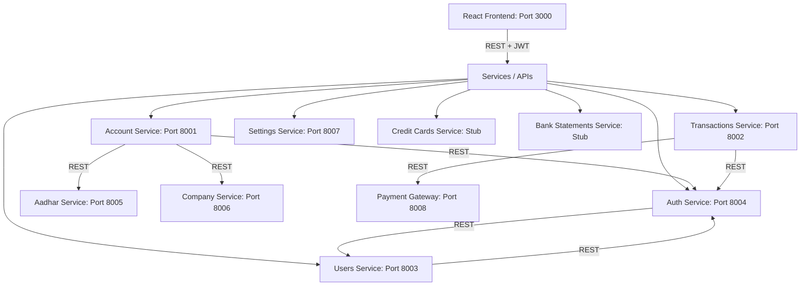

# Global Digital Bank (GDB) - Microservices Architecture & Data Flow

This document provides a comprehensive overview of the Global Digital Bank (GDB) system, explaining the roles of different microservices, their corresponding database schemas, and how they communicate and exchange data.

---

## 1. Microservices Architecture Overview

The system consists of a modern React frontend and a set of Spring Boot microservices. Each backend service is self-contained and serves a specific domain.



### Services Reference Table

| Service Name | Port | Database / Schema | Primary Responsibility |
| :--- | :--- | :--- | :--- |
| **Auth Service** | `8004` | `gdb_auth_db` | Handles authentication, JWT issuance, token validation, token revocation, and authentication auditing. |
| **Users Service** | `8003` | `gdb_users_db` | Manages banking staff profiles (roles: `ADMIN`, `MANAGER`, `TELLER`) and credentials validation. |
| **Account Service** | `8001` | `gdb_accounts_db` | Manages bank accounts (Savings, Current), balance, privilege tiering (`SILVER`, `GOLD`, `PREMIUM`), and branches. |
| **Transactions Service**| `8002` | `gdb_transactions_db` | Orchestrates deposits, withdrawals, fund transfers (IMPS, NEFT, RTGS, UPI), and enforces transaction limits. |
| **Aadhar Service** | `8005` | None (Mock) | Mock external identity verification service used to validate Aadhar numbers during savings account creation. |
| **Company Service** | `8006` | None (Mock) | Mock external business registration service used to validate company details for current accounts. |
| **Payment Gateway** | `8008` | None (Mock) | Simulates external merchant payment gateway operations (debit/credit transactions). |
| **Settings Service** | `8007` | None | Manages user/system preferences such as local currency formatting and date-time configurations. |
| **Credit Cards Service**| Stub | None | Stub service for managing credit card applications, transaction limits, and statements. |
| **Bank Statements Service**| Stub | None | Stub service for generating and exporting customer bank account statements. |

---

## 2. Database Schemas

All databases run on **PostgreSQL** (port `5432`). Schemas are automatically managed using **Flyway migrations** (`db/migration/`).

### A. Users Service (`gdb_users_db`)

Manages bank employees/users who access the portal.

#### 1. `users` Table
Tracks user identities, roles, and status.

| Column | Type | Constraints | Description |
| :--- | :--- | :--- | :--- |
| `user_id` | `BIGSERIAL` | `PRIMARY KEY` | Unique user identifier. |
| `username` | `VARCHAR(255)` | `NOT NULL` | Full name of the user. |
| `login_id` | `VARCHAR(50)` | `NOT NULL, UNIQUE` | Login username/identifier. |
| `password` | `VARCHAR(255)` | `NOT NULL` | BCrypt encrypted password. |
| `role` | `VARCHAR(50)` | `CHECK (role IN ('ADMIN','MANAGER','TELLER'))` | System authorization level. |
| `is_active` | `BOOLEAN` | `DEFAULT TRUE` | Account activation flag. |
| `created_at` | `TIMESTAMP` | `DEFAULT CURRENT_TIMESTAMP` | Time of creation. |
| `updated_at` | `TIMESTAMP` | `DEFAULT CURRENT_TIMESTAMP` | Last updated timestamp. |

#### 2. `user_audit_log` Table
Audits state modifications on the users table.

| Column | Type | Constraints | Description |
| :--- | :--- | :--- | :--- |
| `audit_id` | `BIGSERIAL` | `PRIMARY KEY` | Unique log entry identifier. |
| `user_id` | `BIGINT` | `FOREIGN KEY` references `users(user_id)` | Target user being audited. |
| `action` | `VARCHAR(50)` | `CHECK (action IN ('CREATE','UPDATE','ACTIVATE','INACTIVATE','REACTIVATE'))` | Change event type. |
| `old_data` | `JSONB` | | State before modification. |
| `new_data` | `JSONB` | | State after modification. |
| `timestamp` | `TIMESTAMP` | `DEFAULT CURRENT_TIMESTAMP` | Record timestamp. |

---

### B. Auth Service (`gdb_auth_db`)

Tracks tokens and processes login audits.

#### 1. `auth_tokens` Table
Maintains active token metadata to support token revocation.

| Column | Type | Constraints | Description |
| :--- | :--- | :--- | :--- |
| `id` | `UUID` | `PRIMARY KEY, DEFAULT gen_random_uuid()` | Unique record ID. |
| `user_id` | `BIGINT` | `NOT NULL` | Referenced user ID from User Service. |
| `login_id` | `VARCHAR(255)` | `NOT NULL` | Associated login ID. |
| `token_jti` | `VARCHAR(255)` | `NOT NULL, UNIQUE` | Unique JWT ID (JTI claim). |
| `issued_at` | `TIMESTAMP` | `NOT NULL` | Token creation time. |
| `expires_at` | `TIMESTAMP` | `NOT NULL` | Token expiration time. |
| `is_revoked` | `BOOLEAN` | `DEFAULT FALSE` | Revocation status flag. |
| `created_at` | `TIMESTAMP` | `DEFAULT CURRENT_TIMESTAMP` | Record creation time. |

#### 2. `auth_audit_logs` Table
Audits authentication requests.

| Column | Type | Constraints | Description |
| :--- | :--- | :--- | :--- |
| `id` | `UUID` | `PRIMARY KEY, DEFAULT gen_random_uuid()` | Unique log identifier. |
| `login_id` | `VARCHAR(255)` | `NOT NULL` | Attempted login ID. |
| `user_id` | `BIGINT` | | User ID (if matched). |
| `action` | `ENUM` | `LOGIN_SUCCESS, LOGIN_FAILURE, TOKEN_REVOKED` | Type of authentication event. |
| `reason` | `VARCHAR(500)` | | Failure description (e.g., "Invalid Credentials"). |
| `ip_address` | `INET` | | Originating IP address of request. |
| `user_agent` | `VARCHAR(1000)`| | Originating browser info. |
| `created_at` | `TIMESTAMP` | `DEFAULT CURRENT_TIMESTAMP` | Log timestamp. |

---

### C. Account Service (`gdb_accounts_db`)

Houses account credentials, balances, and profiles.

#### 1. `accounts` Table
Core account entity.

| Column | Type | Constraints | Description |
| :--- | :--- | :--- | :--- |
| `id` | `BIGSERIAL` | `PRIMARY KEY` | Record ID. |
| `account_number` | `BIGINT` | `NOT NULL, UNIQUE, DEFAULT nextval('account_number_seq')` | Generated banking account number. |
| `account_type` | `VARCHAR(20)` | `NOT NULL (SAVINGS, CURRENT)` | Category of bank account. |
| `name` | `VARCHAR(255)` | `NOT NULL` | Primary account holder's name. |
| `pin_hash` | `VARCHAR(255)` | `NOT NULL` | Encrypted transaction PIN. |
| `balance` | `NUMERIC(15,2)`| `DEFAULT 0.00, CHECK (balance >= 0)` | Current account ledger balance. |
| `privilege` | `VARCHAR(20)` | `NOT NULL (SILVER, GOLD, PREMIUM)` | Membership tiers determining limits. |
| `bank_name` | `VARCHAR(255)` | `DEFAULT 'Global Digital Bank'` | Bank institution. |
| `bank_branch` | `VARCHAR(255)` | `DEFAULT 'Main Branch'` | Branch location. |
| `ifsc_code` | `VARCHAR(20)` | `DEFAULT 'GDB0000001'` | Routing IFSC code. |
| `is_active` | `BOOLEAN` | `DEFAULT TRUE` | Account status. |
| `activated_date`| `TIMESTAMP` | `DEFAULT CURRENT_TIMESTAMP` | Account activation date. |
| `closed_date` | `TIMESTAMP` | | Account closing date (if inactive). |

#### 2. `savings_account_details` Table
Supplementary profile data for savings accounts.

| Column | Type | Constraints | Description |
| :--- | :--- | :--- | :--- |
| `id` | `BIGSERIAL` | `PRIMARY KEY` | Record ID. |
| `account_number` | `BIGINT` | `UNIQUE, FOREIGN KEY` references `accounts(account_number)` | Core account association. |
| `date_of_birth` | `DATE` | `NOT NULL` | Customer birthday. |
| `gender` | `VARCHAR(20)` | `NOT NULL (Male, Female, Others)` | Customer gender. |
| `phone_no` | `VARCHAR(20)` | `NOT NULL` | Contact number. |
| `aadhar_number` | `VARCHAR(12)` | `NOT NULL` | verified Aadhar reference. |

#### 3. `current_account_details` Table
Supplementary profile data for business accounts.

| Column | Type | Constraints | Description |
| :--- | :--- | :--- | :--- |
| `id` | `BIGSERIAL` | `PRIMARY KEY` | Record ID. |
| `account_number` | `BIGINT` | `UNIQUE, FOREIGN KEY` references `accounts(account_number)` | Core account association. |
| `company_name` | `VARCHAR(255)` | `NOT NULL` | Registered company name. |
| `website` | `VARCHAR(255)` | | Company URL. |
| `registration_no`| `VARCHAR(50)` | `UNIQUE, NOT NULL` | Business registration code. |

#### 4. `idempotency_records` Table
Guarantees transactional operations are not executed multiple times.

| Column | Type | Constraints | Description |
| :--- | :--- | :--- | :--- |
| `id` | `BIGSERIAL` | `PRIMARY KEY` | Record ID. |
| `idempotency_key`| `VARCHAR(255)`| `UNIQUE, NOT NULL` | Client-provided unique request key. |
| `response_body` | `TEXT` | | Cached response JSON. |

---

### D. Transactions Service (`gdb_transactions_db`)

Processes ledger updates and transaction auditing.

#### 1. `fund_transfers` Table
Tracks inter-account transfers.

| Column | Type | Constraints | Description |
| :--- | :--- | :--- | :--- |
| `id` | `BIGSERIAL` | `PRIMARY KEY` | Transfer ID. |
| `from_account` | `BIGINT` | `NOT NULL` | Origin account number. |
| `to_account` | `BIGINT` | `NOT NULL` | Destination account number. |
| `transfer_amount`| `NUMERIC(15,2)`| `NOT NULL, CHECK (amount > 0)` | Funds moved. |
| `transfer_mode` | `VARCHAR(20)` | `CHECK IN ('NEFT', 'RTGS', 'IMPS', 'UPI')` | Payment rail used. |
| `created_at` | `TIMESTAMP` | `DEFAULT CURRENT_TIMESTAMP` | Transfer time. |

#### 2. `transaction_logging` Table
A unified audit ledger of all transaction operations (Deposits, Withdrawals, Transfers).

| Column | Type | Constraints | Description |
| :--- | :--- | :--- | :--- |
| `id` | `BIGSERIAL` | `PRIMARY KEY` | Transaction entry ID. |
| `account_number` | `BIGINT` | `NOT NULL` | Target account number. |
| `amount` | `NUMERIC(15,2)`| `NOT NULL` | Transaction volume. |
| `transaction_type`| `VARCHAR(20)`| `CHECK IN ('WITHDRAW', 'DEPOSIT', 'TRANSFER')` | Operation type. |
| `created_at` | `TIMESTAMP` | `DEFAULT CURRENT_TIMESTAMP` | Execution time. |

#### 3. `transfer_limits` Table
Enforces limits depending on customer tier.

| Column | Type | Constraints | Description |
| :--- | :--- | :--- | :--- |
| `privilege` | `VARCHAR(20)` | `PRIMARY KEY (SILVER, GOLD, PREMIUM)`| Account privilege tier. |
| `daily_limit` | `NUMERIC(15,2)`| `NOT NULL` | Max transfer value per day. |
| `per_transaction_limit`| `NUMERIC(15,2)`| `NOT NULL` | Max single transfer limit. |

---

## 3. Inter-Service Data Handling & API Workflows

GDB uses synchronous REST communication via Spring `RestTemplate`. The services are bound together by JWT authentication and domain client relationships.

### A. Authentication & Security Workflow

To secure endpoints across microservices, a shared JWT token scheme is utilized:

1. **Token Generation:** 
   The React frontend calls `Auth Service` (`POST /api/v1/auth/login`). `Auth Service` communicates with `Users Service` (`POST /api/v1/users/verify`) to authenticate credentials. Upon success, `Auth Service` generates a signed JWT and returns it.
2. **Access Control (Security Filter):**
   When the client requests resources from `Account Service` or `Transactions Service`, it sends the JWT in the `Authorization: Bearer <token>` header.
3. **Validation Call:**
   The receiving service's `SecurityFilter` intercepts the request and makes a POST request to `Auth Service` (`/api/v1/auth/validate`) passing the token.
4. **Context Propagation:**
   `Auth Service` validates the token status (signature, expiry, and revocation list in `gdb_auth_db`). It returns a payload containing `user_id`, `login_id`, and `role`. The resource service then sets this user context in a ThreadLocal `UserContextHolder` for service-level authorization.

---

### B. Account Verification Workflow

Creating a banking account requires validation from external mock services to ensure regulatory compliance:

```
[Account Service] --(POST /api/v1/aadhar/verify)--> [Aadhar Service] (Returns status)
[Account Service] --(POST /api/v1/companies/verify)--> [Company Service] (Returns status)
```

- **Savings Accounts:** `Account Service` receives the customer Aadhar number and uses `AadharClient` to invoke `Aadhar Service` (`/api/v1/aadhar/verify`). The account is generated only if the client status is validated successfully.
- **Current Accounts:** `Account Service` validates corporate registration details using `CompanyClient` to invoke `Company Service` (`/api/v1/companies/verify`) before creating the corporate account.

---

### C. Fund Transfer & Balance Modification Flow

When a user initiates a transaction:

1. **Request Submission:** The frontend calls `Transactions Service` (`POST /api/v1/transfers`).
2. **Limit Checking:** `Transactions Service` queries the local `transfer_limits` database table. It also aggregates the transaction volume of the source account for the current day from `transaction_logging` to verify the daily cap is not exceeded.
3. **Inter-Service Balance Update:**
   - `Transactions Service` initiates an HTTP REST call to `Account Service` (`POST /api/v1/accounts/debit` and `POST /api/v1/accounts/credit`).
   - `Account Service` updates the database state (`balance` check constraint prevents overdrafts).
   - `Account Service` returns success responses.
4. **Logging and Ledger Writing:** Upon successful balance modification, `Transactions Service` logs the transfer details in the local `fund_transfers` table and adds entries in the `transaction_logging` ledger.
