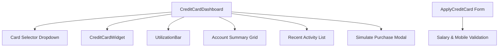

# Credit Card Management Module - Frontend Design System

This document details the frontend design patterns, UI/UX aesthetics, layout structures, and integration architecture applied within the **Credit Card Management** module of the Global Digital Bank application.

---

## 1. Design Aesthetics & Visual Tokens

The frontend design is built with a premium, sleek feel that combines standard modern styling utilities (TailwindCSS layout conventions) with high-fidelity custom glassmorphism and gradient patterns.

### Color Palette & Visual Tiers
Different color schemes are mapped to card categories to establish hierarchy and user status:
*   **Silver Tier Card**: 
    *   *Theme*: Subtle light-gray gradients (`from-gray-300 to-gray-100` / `from-gray-100 to-gray-200`).
    *   *Feel*: Clean, minimal, utility-focused.
*   **Gold Tier Card**: 
    *   *Theme*: Warm, rich champagne-gold gradients (`from-yellow-500 to-yellow-300` / `from-yellow-50 to-amber-100`).
    *   *Feel*: Premium, accessible luxury.
*   **Platinum Tier Card**: 
    *   *Theme*: Deep slate/dark gray gradients (`from-gray-900 to-gray-700` / `from-gray-800 to-gray-900`).
    *   *Feel*: Ultra-premium, exclusive, high-contrast dark mode.

---

## 2. Component Architecture

The interface uses a clean, reusable component layout:

### Key Components

#### 1. `CreditCardWidget.jsx`
Renders a visual representation of a high-fidelity physical credit card.
*   **Visual Highlights**: High-contrast typography, realistic contactless chip shape, brand logo positioning, and gradient card styling based on tier.
*   **Field Mapping**: Reads and displays real values for Cardholder Name (`data.name`), Expiry Date (`data.expiryDate`), CVV (`data.cvv`), and masked or full card number.

#### 2. `UtilizationBar.jsx`
A custom progressive indicator mapping available balance against overall credit limit.
*   **UX Pattern**: Visually warns the user dynamically as outstanding debt nears the card limit.

#### 3. `SimulatePurchaseModal`
A simulated sandbox checkout overlay embedded in the main dashboard.
*   Allows the user to trigger mock purchases to verify validation limits and outstanding balance adjustments in real-time.

---

## 3. Form Design & UX Flow (Application & Validation)

The card application wizard ([`ApplyCreditCard.jsx`](file:///Users/sagarsewak/Documents/Personal/College/STEP/OFFLINE/gdb-service-feature-java-additional-services/frontend/src/Additional%20Features/Credit%20Card%20Management/pages/ApplyCreditCard.jsx)) is split into two logical areas:

1.  **Personal & Identity Details**:
    *   *Full Name*: Validated to prevent blank names.
    *   *Mobile Number*: Map validation requires 10 to 15 digits (using Regex checking).
    *   *Card Nickname*: Optional custom identifier (e.g., "Daily Spends") which is persisted and displayed on both the dashboard selector dropdown and the card widget face.
2.  **Tier Selection & Professional Credentials**:
    *   *Salary Field & Dynamic Alerting*: Validates user income in real-time against selected tier thresholds. If a user selects a Platinum card but enters a salary under ₹50,000, they receive immediate inline validation feedback.

---

## 3.1 Visual Sizing & Overflow Adjustments
To prevent layout breaks when screen width is constrained (such as when the portal's sidebar is expanded):
*   **Card Number Font Sizing**: The font size of the card numbers on `CreditCardWidget.jsx` is scaled responsively (`text-[12px] xs:text-[14px] sm:text-[16px] lg:text-lg`) to prevent trailing digit cutoffs.
*   **12-Column Grid Alignment**: Expires and CVV indicators align correctly without wrapping using a grid-based horizontal layout rather than flexing inline.
*   **Header Button Sizing**: The credit card dropdown, Simulate Purchase, and Apply New Card actions are laid out in a grid containing exactly equal widths on non-mobile screens.

---

## 4. API Integration Layer

Services are abstracted in [`mockCreditCardService.js`](file:///Users/sagarsewak/Documents/Personal/College/STEP/OFFLINE/gdb-service-feature-java-additional-services/frontend/src/Additional%20Features/Credit%20Card%20Management/services/mockCreditCardService.js) using Axios APIs mapping directly to backend endpoints:

*   **Fetch User Cards**: `GET /api/v1/credit-cards/user/{userId}`
*   **Card Application**: `POST /api/v1/credit-cards/apply`
*   **Card Transactions**: `GET /api/v1/credit-cards/{id}/transactions`
*   **Simulate Spend**: `POST /api/v1/credit-cards/{id}/transactions`
*   **Bill Payment**: `POST /api/v1/credit-cards/{id}/pay`
